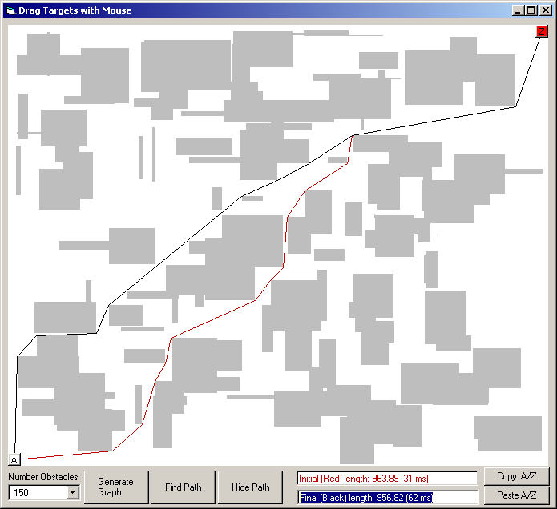



## LaVolpe PathFinder IV: Non\-Tiled Graphs

### Description

[No code update; only added the missing RTF file]. Fastest non-tiled graph path finder. Extended my unique approach &amp; believe it is 100% accurate and still very fast. This approach uses window regions to process open space very quickly. Where A* &amp; Dijkstra require known distances between nodes, this project kinda explores on the fly, creating the needed link structure as it explores. Give it a go &amp; if you want to discuss better logic/routines, please email me. P.S. Sorry about the large screenshot: wanted to show you the size of a graph &amp; it's potential speed. Thanx goes to Stavros Sirigos for getting me re-interested in this project. Updated: a bit faster &amp; fixed routine to recognize when start/end nodes in same regional rectangle. Updated 18Jun: added efficiency tweaks &amp; correct path error that occurs maybe 1 out of 1000 paths.
 
### More Info
 

             |
---                |---
**Submitted On**   |2007-04-21 19:08:40
**By**             |[LaVolpe](https://github.com/Planet-Source-Code/PSCIndex/blob/master/ByAuthor/lavolpe.md)
**Level**          |Advanced
**User Rating**    |4.9 (187 globes from 38 users)
**Compatibility**  |VB 6\.0
**Category**       |[Miscellaneous](https://github.com/Planet-Source-Code/PSCIndex/blob/master/ByCategory/miscellaneous__1-1.md)
**World**          |[Visual Basic](https://github.com/Planet-Source-Code/PSCIndex/blob/master/ByWorld/visual-basic.md)
**Archive File**   |[LaVolpe\_Pa2061534212007\.zip](https://github.com/Planet-Source-Code/lavolpe-lavolpe-pathfinder-iv-non-tiled-graphs__1-61062/archive/master.zip)

